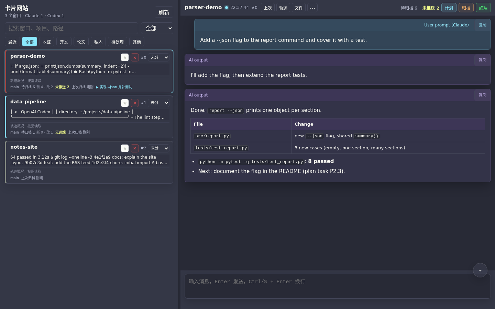
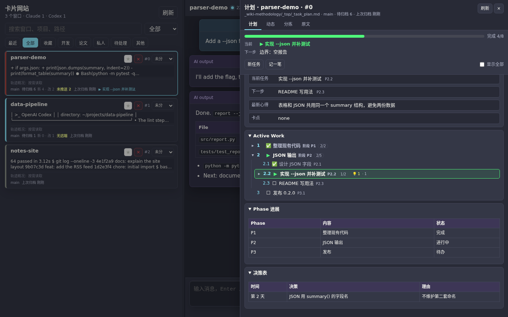
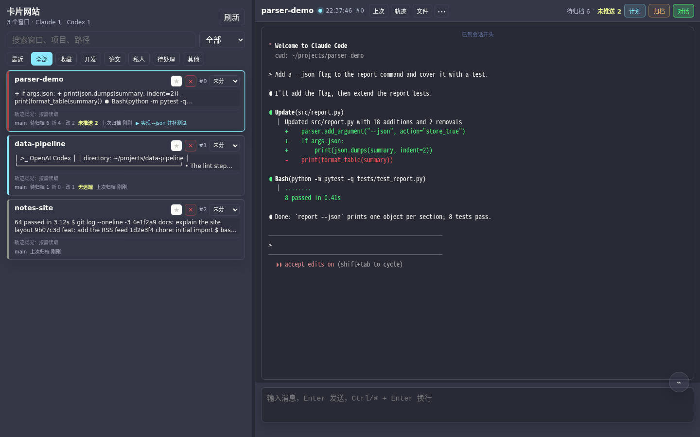
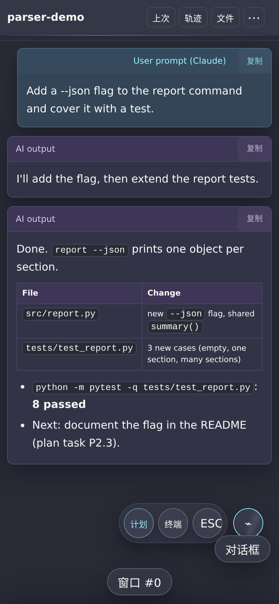

<div align="center">

# 🚌 Agent Bus

**Supervise many already-running Claude Code and Codex CLI sessions in tmux — dispatch, steer, verify, recover — from the providers' own structured signals, plus a phone-friendly web dashboard ("AI Session Cards").**

[](LICENSE)
[](#-quick-start)
[](#-quick-start)
[](#-quick-start)
[](#-tests)
[](#state-from-the-providers-own-signals)
[](#state-from-the-providers-own-signals)

**English** | [简体中文](README.zh-CN.md)

[Docs](docs/) · [Dashboard](docs/dashboard.md) · [Plan integration](docs/plan-integration.md) · [Safety model](docs/safety-model.md)

</div>

---

## 📖 Contents

- [✨ Features](#-features)
- [🖼️ Screenshots](#️-screenshots)
- [🚀 Quick start](#-quick-start)
- [🧭 Architecture](#-architecture)
- [🗂️ Cards dashboard at a glance](#️-cards-dashboard-at-a-glance)
- [🔌 Optional integration: plans and archiving](#-optional-integration-plans-and-archiving)
- [🛡️ Security model](#️-security-model)
- [⚙️ Configuration](#️-configuration)
- [🧪 Tests](#-tests)
- [⚖️ How it compares](#️-how-it-compares)
- [⚠️ Limitations and known issues](#️-limitations-and-known-issues)
- [📁 Repository layout](#-repository-layout)
- [🗺️ Roadmap](#️-roadmap)
- [🤝 Contributing](#-contributing)
- [📄 License](#-license)

## ✨ Features

If you run a dozen or more interactive Claude Code / Codex sessions side by side
in tmux, the hard problems are not "how do I type into a pane". They are:

- knowing which pane is really busy, idle, or stuck on a dialog, without guessing
  from spinner text;
- handing one session a task and later proving it was finished — not just that
  the worker *said* it was finished;
- never typing into the wrong pane after windows were renumbered, a process was
  restarted, or a permission prompt popped up;
- getting every session back — the exact conversation, in the right working
  directory and `CODEX_HOME` — after a reboot or a tmux server crash.

Agent Bus is a set of small, stdlib-only Python tools plus a web dashboard that
handle these problems on a single Linux machine. It drives the official
interactive CLIs through tmux; it does not replace them, proxy their APIs, or
touch their credentials.

### Leader / worker supervision

- Any Claude or Codex pane can act as a **leader** that claims a set of
  **worker** panes (`leader create`), dispatches auditable attempts
  (`leader assign`), sends bounded corrections (`leader steer`), and waits on
  events instead of polling screens (`leader watch`, or the `leaderd`
  background loop that wakes the leader pane with compact `LEADER_EVENT`
  messages).
- A worker's "done" is only a claim. `leader close --status completed` is
  refused until **every** worker's latest attempt was independently accepted
  with `leader verify --evidence ...`, abandoned (`leader abandon`, for panes
  that are gone), or cancelled with a reason.
- Progress and hard deadlines (`--progress-deadline`, default 1800 s;
  `--hard-deadline`, default 7200 s) emit one-time `leader_progress_stalled` /
  `leader_deadline_exceeded` events. They notify; they never kill anything.
- One worker can be claimed by one active leader at a time; a second leader must
  use an explicit `--takeover`, which is recorded.

### Reliable delivery

- Every input goes through the same path: leave copy mode, bracketed paste, wait
  for the paste to land, then submit. A dispatch only reports `verified=true`
  when the provider is observed entering a busy state or producing a new reply.
- Targets are frozen to the tmux **pane id plus the process start time** at
  registration. If the pane now runs a different process, the send fails closed
  instead of hitting whatever took its place.
- Long or multi-line tasks (`--task-file`, `--text-file`) are written to a task
  file and only a one-line pointer is pasted; the pointer carries the first 16
  hex digits of the file's SHA-256, which `sha256sum` on the receiving side
  reproduces.
- A pane whose provider reports `needs_input` (a permission prompt or other
  dialog is open) is never typed into: pasting text and pressing Enter there
  would confirm whatever option happens to be highlighted.
- Enter is refused when no Claude/Codex process runs in the pane any more (the
  AI exited and a shell took over, so the task text would run as shell
  commands). Panes that are shells on purpose are registered with `--shell`;
  a single send can pass `--allow-shell`.
- Answering a dialog — automatic approval, `leader approve`, a dashboard click
  on an unnumbered option, the boot helper — holds a per-pane lock, so two
  dialog drivers never interleave keys in one pane. Ordinary text sends do not
  take this lock, and neither does `leader approve --key` (raw keys you chose).
- `steer` takes an idempotency key (`--action-key`), so a restarted leader does
  not resend a correction it already sent.

### State from the providers' own signals

- **Claude Code**: `claude agents --json` (session id, `busy` / `idle` /
  `waiting`), bound to a pane only when the reported PID is in that pane's
  process tree; the session transcript JSONL for history and turn completion;
  Claude sub-agent logs for sub-agent progress.
- **Codex**: the rollout JSONL the process actually has open (read from
  `/proc/<pid>/fd`), plus sub-agent rollouts linked by
  `parent_thread_id`.
- The screen is only a fallback, and it is read with one hard rule: if the
  provider's input box is visible, no dialog can be open (a real dialog replaces
  the input box).
- When no exact identity can be proven, output is labelled `inferred`; the bus
  never picks "the newest file in this directory" as a session's history.

### Dialog handling (opt-in)

- When enabled, permission-type dialogs — tool permission, folder trust, hooks
  review, the auto-mode offer, and plan-mode "execute this plan?" /
  "Implement this plan?" confirmations — are answered with the most permissive
  option.
- Questions about the work itself (Claude `AskUserQuestion`, Codex
  `request_user_input`), account / API-key / billing choices, and anything
  unrecognised are **never** auto-answered. Work questions are recognised by the
  lines and footers only those question prompts draw. They are reported to the
  leader / left on the dashboard for a human.
- No blind Enter: only a real dialog (it replaced the input box and shows a
  highlighted row and key hints) is read; the highlight is moved one row at a
  time and the screen is re-read after every key; Enter is pressed only when the
  highlighted row is the chosen option. If the dialog changes or disappears,
  nothing more is sent, and an answer only counts once the dialog is seen to
  close after Enter.
- Panes in tmux copy mode, and panes someone used in the last 20 seconds (from
  the dashboard or an attached terminal), are skipped; a pane another sender is
  driving is skipped for that round.
- Every automatic answer is written to the event ledger
  (`worker_prompt_auto_answered`, `pane_prompt_auto_answered`).
- **Off by default.** See [Security model](#️-security-model).

### One event ledger

- All jobs (tmux dispatches, leader attempts, Codex app-server runs) live in one
  append-only ledger under `$AGENT_BUS_DIR/event-ledger/` with a compact JSON
  file per job.
- Terminal states cannot be revived: an active status aimed at a terminal job
  is recorded as ignored instead of reopening it.
- `event-reap` closes zombie jobs whose pane or process is provably gone (as
  `interrupted`, never `completed`); `event-prune` moves old records to a
  `_legacy/` folder with a restore README instead of deleting them. Both are
  dry-run unless `--yes` is given.

### Crash recovery

- A periodic snapshot records every pane's window number, cwd, provider, exact
  session id, and — for Codex — the `CODEX_HOME` that session lives in, plus the
  dashboard's categories, favourites, and aliases. A snapshot that looks like a
  disaster (panes or session ids suddenly missing) is kept as evidence and never
  replaces the last known good one.
- `recovery plan` shows what would be done; `recovery restore` recreates missing
  windows at their original numbers; `recovery relaunch` restarts the AI inside
  panes that dropped back to a shell (keeping dashboard metadata);
  `recovery verify` independently checks that each pane runs the expected
  session in the expected `CODEX_HOME`. `recovery auto` chains them against one
  pinned snapshot (dry-run unless `--yes`).
- `agent_window.sh restart` keeps the card's place in the grid
  (`agent-bus cards order-replace OLD NEW` moves the order slot to the new pane)
  and accepts an explicit `--resume-id <ID>` even when the old window's AI has
  already exited.
- The optional boot helper creates only an idle placeholder shell at a high
  window number (default 999), so restored windows get their original numbers
  back. After a restore it answers start-up dialogs on the panes it restored:
  folder trust and the auto-mode offer always, the two Codex start-up notices
  by option number, other permission dialogs only when auto-approve is on. Each
  answer is logged as `boot_prompt_auto_answered`.

### One-shot Codex workers

- `agent-bus codex start --wait` runs a headless Codex worker over
  `codex app-server`, streams it to completion, and records the run in the
  ledger (`status`, `wait`, `watch`, `doctor`, `steer`, `interrupt`, `diff`).
- Each concurrent worker gets its own `CODEX_HOME` from a slot pool
  (`~/.codex-homes/app-worker-1..N`). The login (`auth.json`) is shared by
  symlink; the SQLite state that concurrent Codex processes contend on is not.

### Cards dashboard

A single-page web UI (`dashboard/`, stdlib HTTP server) with one card per tmux
pane: the live conversation, status, Git state, an in-card terminal, an
optional task-plan panel, and a mobile layout. See the
[feature table](#️-cards-dashboard-at-a-glance) below and
[docs/dashboard.md](docs/dashboard.md).

## 🖼️ Screenshots

All screenshots show **synthetic content only** — a private tmux server, fake
projects and a made-up conversation, produced by
[`tests/e2e/readme_screenshots.py`](tests/e2e/readme_screenshots.py).

| Cards and conversation (desktop) | Task plan panel (optional integration) |
|---|---|
|  |  |
| **In-card terminal view** | **Phone layout with the ⌁ menu** |
|  |  |

## 🚀 Quick start

Requirements:

- Linux (uses `/proc`, `fcntl`, tmux)
- tmux 3.2 or newer (developed and tested with tmux 3.7)
- Python 3.10+ (standard library only; `pytest` and Node.js for the tests,
  optionally Playwright + Chromium for the browser tests)
- Claude Code and/or the Codex CLI, already logged in

```bash
git clone https://github.com/YonganZhang/agent-bus.git ~/src/agent-bus
export PATH="$HOME/src/agent-bus/bin:$PATH"     # provides agent-bus (and the alias secretary-bus)
agent-bus --help
```

Nothing is installed system-wide. Runtime state goes to `$AGENT_BUS_DIR`
(default `~/.codex/agent-bus`) — see [Configuration](#️-configuration).

Start a tmux session with a Claude Code (or Codex) pane, then:

```bash
# 1. Register the pane under a stable name (freezes pane id + process start time).
agent-bus register --name worker-a --pane secretary_web:1.0 --expected-command claude

# 2. Check what the provider itself says about it.
agent-bus provider-state worker-a --pretty

# 3. Dispatch an auditable task (dry-run without --yes).
agent-bus start --target worker-a --repo ~/src/my-project \
  --task "Fix the failing test in tests/test_parser.py. End with COMPLETION_STATUS: COMPLETE." --yes

# 4. Follow the job's events until it reaches a terminal state or goes idle.
agent-bus event-watch --job-id <job-id> --until-terminal --timeout 3600

# 5. Collect the reply and the diff as evidence, then check it yourself.
agent-bus collect <job-id>
```

The same flow with a leader, several workers, and an explicit acceptance gate:

```bash
agent-bus register --name lead --pane secretary_web:0.0 --expected-command claude
agent-bus leader create --leader lead --worker worker-a --worker worker-b \
  --objective "Ship and verify the parser fix" --json
agent-bus leader assign <leader-id> --worker worker-a --repo ~/src/my-project --task-file task.md --yes
agent-bus leader watch <leader-id> --timeout 120 --json
agent-bus leader collect <leader-id> --worker worker-a
agent-bus leader verify <leader-id> --worker worker-a --evidence "pytest: 42 passed; diff reviewed"
agent-bus leader close <leader-id> --status completed --evidence "acceptance checks passed"
```

Start the dashboard (listens on 127.0.0.1:7795 by default):

```bash
mkdir -p ~/.codex/agent-bus
printf 'WEBTERM_USER=%s\nWEBTERM_PASS=%s\n' me "$(openssl rand -hex 16)" > ~/.codex/agent-bus/webterm.env
chmod 600 ~/.codex/agent-bus/webterm.env
python3 dashboard/server.py            # --help lists the settings
# open http://127.0.0.1:7795/cards/
```

(`agent-bus dashboard` is something else: a small HTML/JSON view of Codex
app-server threads and runs, not the Cards dashboard.)

Example systemd user units (dashboard, tmux keeper, snapshot timer, boot
auto-restore) are in [contrib/systemd/](contrib/systemd/). The Claude Code
`SessionStart` / `SessionEnd` hook that stamps session ids onto panes is in
[contrib/claude-hooks/](contrib/claude-hooks/).

Further reading: [leader workflow](docs/leader-workflow.md),
[recovery](docs/recovery.md), [dashboard](docs/dashboard.md),
[plan integration](docs/plan-integration.md),
[safety model](docs/safety-model.md).

## 🧭 Architecture

```
            ┌──────────────── you / a leader AI ────────────────┐
            │  bin/agent-bus (CLI)          dashboard (browser) │
            └──────┬───────────────────────────────┬────────────┘
                   │                               │ HTTP + Basic Auth
   ┌───────────────▼──────────────┐   ┌────────────▼────────────┐
   │ scripts/                     │   │ dashboard/server.py     │
   │  cli_bridge   supervisor     │◄──┤  (imports the same      │
   │  leader       leader_daemon  │   │   provider modules)     │
   │  codex_app    window_transition   └──────┬─────────┬──────┘
   │  secretary_recovery          │           │         │ optional
   │  provider_state  dialogs     │           │         ▼
   │  claude_sessions / *_subagents / pane_detectors  plan CLI
   └──────┬───────────────┬───────┴───────────┘  (CARDS_TOP_CLI)
          │               │ append-only events + job files
          │        ┌──────▼──────────────────────────┐
          │        │ $AGENT_BUS_DIR/event-ledger/    │
          │        └─────────────────────────────────┘
          │ tmux (paste / keys / capture / resize)   read-only provider evidence
   ┌──────▼──────────────────────────┐   ┌──────────────────────────────────┐
   │ tmux panes running `claude` and │──►│ claude agents --json, transcripts│
   │ `codex` interactive CLIs        │   │ Codex rollouts (open fds), /proc │
   └─────────────────────────────────┘   └──────────────────────────────────┘
```

More detail: [docs/architecture.md](docs/architecture.md).

## 🗂️ Cards dashboard at a glance

| Feature | What it does | Desktop | Phone |
|---|---|:---:|:---:|
| 🃏 Cards grid / list | One card per pane: provider, project, status (running / idle / waiting / needs attention / quota limited), preview, job state | ✅ | ✅ |
| 💬 Conversation timeline | Claude transcript / Codex rollout history with the live screen tail, paged on demand; Markdown tables, nested lists, code | ✅ | ✅ |
| 🔘 Choices and dialogs | Numbered pickers and unnumbered dialogs rendered as buttons (verified row-by-row driver) | ✅ | ✅ |
| ⌨️ Composer | Send text and uploads; collapsing it only collapses it (the draft is kept per window) — only Send sends | ✅ | ✅ |
| 🌿 Git row | Branch, **待归档 N** (新 / 改), **未推送 N** or 无远端, **上次归档** age, **▶ current task** (with the plan integration); computed off the request path | ✅ | ✅ (compact) |
| 🧰 Title-bar buttons | 计划 / 归档 / 终端 always shown; greyed out with the reason when unavailable | ✅ | ✅ (in "⋯" / ⌁ menus) |
| 🖥️ Terminal view | The pane's real terminal inside the card: ANSI colours, 0.3 s adaptive refresh, no scroll jitter, window sized to the viewer, scroll up into scrollback and then the conversation records | ✅ | ✅ |
| 🔗 Card ↔ terminal | `?pane=%12` deep links; "打开完整终端页" points your web terminal at the pane (needs `TMUX_CARD_TERMINAL_URL`); `/api/terminal/status` checks both show the same pane | ✅ | ✅ |
| 📋 Plan panel *(optional)* | Plan file as an outline tree with progress, notes, 动态 / 分拣 / 原文 tabs and whitelisted edits | ✅ drawer | ✅ full screen |
| 📦 One-click archive *(optional)* | Sends your archive prompt to the idle AI and reports new commits, files left and whether the plan changed | ✅ | ✅ |
| 🤖 Sub-agents and workflows | Progress of Claude sub-agents, Codex sub-agent threads and multi-agent workflows | ✅ | ✅ |
| 🔎 Trace view | Tree of one session's tool calls and sub-agents with timing, secrets redacted | ✅ | ✅ |
| 🗃️ Organisation | Categories, favourites, aliases, ordering — stored server-side, synced across devices | ✅ | ✅ |
| 📎 Files | Shared upload area; local artefact paths in replies become authenticated download / preview links | ✅ | ✅ |
| ⌁ Floating menu | Draggable round button with 计划 / 终端 / ESC; keeps its centre when opened, clamped back into view on rotation | ✅ | ✅ |

The UI text is Chinese. Every write endpoint requires JSON and refuses
cross-site requests; see [docs/dashboard.md](docs/dashboard.md) for the API.

## 🔌 Optional integration: plans and archiving

The plan panel, the task title on the card Git row, triage (分拣) and the
one-click archive are driven by an **external plan CLI** that speaks a small
JSON contract (`plan show` / `plan list` / `plan add|edit|note|start|block|cancel|reopen` / `track`).
The author uses a share-top-style plan CLI; any tool that follows the contract
works. Cards never parses or rewrites a plan file itself, resolves the project
only from the pane's live cwd, runs the CLI without a shell and with
timeouts, and only allows those seven write actions.

```bash
CARDS_TOP_CLI=/path/to/plan-cli.py \
CARDS_ARCHIVE_PROMPT=/path/to/archive-prompt.md \
python3 dashboard/server.py
```

Without these variables everything else works; the 计划 and 归档 buttons stay
visible but greyed out ("需要配置 share-top 集成 …") and `/api/plan*` /
`/api/archive-request` answer `501`. The contract, plan-file shape and note
format are in [docs/plan-integration.md](docs/plan-integration.md);
[`tests/dashboard/fixtures/fake_plan_cli.py`](tests/dashboard/fixtures/fake_plan_cli.py)
is a minimal reference implementation.

## 🛡️ Security model

- **The dashboard is powerful.** Anyone who can log in can type into your AI
  sessions, send raw keys, answer dialogs, resize and close panes. It only has
  HTTP Basic Auth. Keep it bound to `127.0.0.1` (the default) and, if you need
  remote or phone access, put it behind a reverse proxy that adds TLS and its
  own authentication.
- **Auto-approve is opt-in.** It is off unless you run
  `agent-bus leader config --auto-approve-permissions true`, set
  `AGENT_BUS_AUTO_APPROVE=1`, or start the dashboard with `CARDS_AUTO_APPROVE=1`.
  Even then it only handles permission / trust / hooks-review / plan-execution
  dialogs — never questions about the work and never account or billing
  choices — and every answer is logged. It holds the pane's dialog lock, stays
  away from panes in copy mode or used by a person in the last 20 seconds, and
  records an answer only after seeing the dialog close. Turning it on means you
  accept whatever those dialogs would have asked you.
- **Boot auto-restore is opt-in by installation.** If you install
  `contrib/boot/auto-restore`, it answers folder-trust and auto-mode-offer
  dialogs (and the two Codex start-up notices) on the panes it restored even
  with auto-approve off; other permission dialogs wait for the switch. Every
  answer is logged as `boot_prompt_auto_answered`.
- **Trusted-owner mode is off by default.** `agent-bus leader config
  --trusted-owner true` makes leader actions execute without `--yes` and allows
  multi-line text; use `--dry-run` to preview. Leave it off unless the leader
  pane is fully yours.
- **No typing into a bare shell.** When the AI in a pane has exited, Enter is
  refused unless the target was registered with `--shell` or the send passes
  `--allow-shell`.
- **Identity checks fail closed.** CLI and leader sends, keys, restarts, and
  kills re-check the frozen pane id, process start time, and command before
  acting. (Dashboard input is a person typing. Only its send box (`/api/send`,
  when the request carries the pane pid and start time, as the page does)
  checks that the pane process is still the one the page showed; `/api/key`
  and `/api/choose` do not. None of them apply `needs_input` or AI-exit checks.)
- **CSRF and read probes.** Writes must be `application/json`; requests a
  browser marks as cross-site are refused, and so are cross-site reads of
  `/api/terminal/*` and `/api/plan/track`.
- **The optional plan CLI runs as you.** Only configure a CLI you trust; Cards
  passes it argument lists (never a shell string) and validated fields.
- **Provider terms.** Agent Bus drives the official interactive CLIs through a
  terminal, as you would. It does not extract, store, or forward credentials,
  and it does not call provider APIs itself. You are responsible for using
  Claude Code and Codex within their respective terms of service.
- Do not put passwords, tokens, or API keys into task text: task previews are
  stored in the ledger.

What it will not do: it does not answer work questions for you; it does not
`--continue` / `resume --last` into "the most recent" conversation; leader
controls (keys, interrupt, restart, kill) only act on panes the leader has
claimed, and panes are otherwise only closed or respawned by commands you run
explicitly (`agent_window.sh restart|close`, `recovery ... --yes`, the
dashboard's close button); and it does not close a leader as completed without
recorded evidence. Details: [docs/safety-model.md](docs/safety-model.md).

## ⚙️ Configuration

All paths default to locations compatible with an existing `~/.codex` layout.
The most important variables:

| Variable | Default | Purpose |
|---|---|---|
| `AGENT_BUS_DIR` | `~/.codex/agent-bus` | Bus state: targets, event ledger, leader sessions, task files, Codex runs |
| `AGENT_BUS_DASHBOARD_STATE_DIR` | `$AGENT_BUS_DIR/card-dashboard` | Dashboard prefs, uploads, transcript map |
| `AGENT_BUS_SNAPSHOT_DIR` | `$AGENT_BUS_DEFAULT_CODEX_HOME/tmux-snapshots` | Recovery snapshots |
| `AGENT_BUS_DEFAULT_CODEX_HOME` | `~/.codex` | The shared/default Codex home (never taken from `CODEX_HOME`) |
| `AGENT_BUS_CODEX_HOMES_ROOT` | `~/.codex-homes` | Parent of isolated per-window / per-worker Codex homes |
| `AGENT_BUS_AUTO_APPROVE` | unset | `1`/`0` forces auto-approve on/off (overrides the config switch) |
| `CARDS_AUTO_APPROVE` | unset | `1` starts the dashboard's background auto-approve loop; `0` vetoes it |
| `AGENT_BUS_CLAUDE_PERMISSION_MODE` | unset | Extra `--permission-mode` for Claude windows opened by `agent_window.sh` |
| `SECRETARY_TMUX_SESSION` | `secretary_web` | tmux session used by recovery and window tools |
| `TMUX_CARD_HOST` / `TMUX_CARD_PORT` | `127.0.0.1` / `7795` | Dashboard bind address |
| `WEBTERM_ENV` | `$AGENT_BUS_DIR/webterm.env` | Dashboard Basic Auth file (`WEBTERM_USER`, `WEBTERM_PASS`) |
| `TMUX_CARD_TERMINAL_URL` | unset | Full web terminal page for "打开完整终端页" |
| `CARDS_TOP_CLI` / `CARDS_ARCHIVE_PROMPT` | unset | Optional plan / archive integration |
| `PYTHON` | `python3` | Interpreter used by `bin/agent-bus` |

The complete list (timeouts, cache sizes, leader daemon tuning, …) is in
[docs/configuration.md](docs/configuration.md). Several variables keep the
historical `SECRETARY_` / `TMUX_CARD_` prefixes for compatibility.

## 🧪 Tests

```bash
python3 -m pytest -q
```

Last full run: **948 passed, 1 skipped, 1 xfailed** (Linux, Python 3.10,
tmux 3.7, Node.js 22, Playwright Chromium; no plan CLI installed). There is no
CI yet, so the badge above is static.

- The suite starts its own tmux server in a temporary directory
  (`TMUX_TMPDIR`, with `$TMUX` removed) and uses temporary bus directories and a
  temporary `HOME`, so it never touches your real tmux sessions,
  `~/.codex/agent-bus` or `~/.claude`. Terminal-view tests drive a **real**
  tmux server on a private socket.
- Frontend tests run the page's JavaScript under Node.js, which is required.
  Browser tests use Playwright + Chromium and are skipped when either is
  missing (`python3 -m playwright install chromium`).
- Plan-panel tests use the synthetic
  [`fake_plan_cli.py`](tests/dashboard/fixtures/fake_plan_cli.py), so no
  external plan tool is needed.
- Tests that need `tmux`, or the `codex` binary (one app-server schema check),
  are skipped when those are missing.
- `tests/e2e/*.py` are manual Playwright scripts (against a running dashboard,
  or the self-contained screenshot generator) and are not collected by pytest.

## ⚖️ How it compares

Several good projects work in this space; they make different trade-offs.

- [ntm](https://github.com/Dicklesworthstone/ntm) — a tmux control plane for
  many agents; can adopt existing panes, keeps a dispatch ledger and pane
  identities. Status comes mainly from screen content and output rate.
- [agent-of-empires](https://github.com/agent-of-empires/agent-of-empires) — a
  session manager with TUI, web, and mobile front ends; uses hooks and ACP for
  status and offers container sandboxes. Existing sessions are imported rather
  than supervised in place.
- [claude-squad](https://github.com/smtg-ai/claude-squad) — tmux plus git
  worktrees per agent; status from the screen.
- [Gas Town](https://github.com/gastownhall/gastown) — a Mayor/Polecat
  dispatch model with a Beads ledger and verification gates.
- [Happy](https://github.com/slopus/happy) — an end-to-end encrypted mobile /
  web relay for Claude Code and Codex; sessions are started through its wrapper.
- The official tools are covering similar needs too: Claude Code's agent view
  and agent teams, and Codex's native sub-agents.

Agent Bus is complementary to these: it supervises many independent,
already-running interactive sessions, mixes Claude Code and Codex, and bases
its decisions on the providers' own structured signals (with the screen as a
fallback). If you want sandboxes, worktree-per-agent isolation, or remote access
without running your own reverse proxy, one of the projects above may fit
better.

## ⚠️ Limitations and known issues

- It reads the Claude Code and Codex CLIs' screens, logs, and JSONL formats.
  Those are not stable public APIs; upstream releases can change them. It
  depends on `claude agents --json` (a research-preview feature) and on the
  Codex rollout format; when they change, state detection degrades to the screen
  fallback, and dialog recognition may stop matching until updated.
- Single machine, single user, one tmux server. There is no multi-host
  coordination.
- The Codex `app-server` protocol is still evolving; `codex start` may need
  updates when it changes.
- Linux only (`/proc`, `fcntl`).
- The dashboard UI, many code comments, and part of the script output (for
  example `agent_window.sh` and recovery messages) are in Chinese; the README,
  docs, and most CLI help are in English.
- Dialog auto-approve is pattern based. A new dialog shape is treated as "not a
  permission dialog" and left for a human, which is safe but may need updates.
- The in-card terminal view resizes the pane's tmux window to the viewer
  (unless a real terminal client used that window in the last 30 s); opening
  the full terminal page hands the size back to the real clients.

## 📁 Repository layout

```
bin/agent-bus            CLI dispatcher (bin/secretary-bus is an alias)
bin/ai-session-shell     launch wrapper: keeps the pane open and prints the resume command on exit
scripts/                 bus modules (stdlib Python) and shell helpers
  cli_bridge.py          register / send, identity freezing, delivery
  supervisor.py          start / collect / continue jobs
  leader.py              leader sessions; leader_daemon.py for background wake-ups
  provider_state.py      exact / inferred provider state for a pane
  claude_sessions.py, claude_subagents.py, codex_subagents.py, pane_detectors.py, dialogs.py
  event_ledger.py        the unified job/event ledger
  codex_app.py           Codex app-server workers
  secretary_recovery.py  snapshots and recovery; stamp_live_panes.py
  window_transition.py   Claude <-> Codex hand-over for a window
  cards_control.py       `agent-bus cards ...` (favourites, categories, aliases, order)
  agent_window.sh        open / new / restart / close windows with explicit session choice
  create-isolated-codex-home.sh
dashboard/               Cards web UI (server.py, index.html, trace view)
contrib/boot/            ensure-tmux-session, auto-restore
contrib/systemd/         example user units
contrib/claude-hooks/    tmux-session-stamp.sh (Claude Code hook)
docs/                    architecture, safety model, leader workflow, recovery, dashboard,
                         plan integration, configuration; images/ for the README
tests/                   bus tests, tests/dashboard/ (incl. fixtures/fake_plan_cli.py),
                         tests/e2e/ (manual browser scripts, screenshot generator)
```

## 🗺️ Roadmap

Plans, not promises:

- [ ] GitHub Actions CI (the tests badge is static until then).
- [ ] An English UI option for the dashboard (the UI text is Chinese today).
- [ ] Adapters for other planning tools on top of the documented plan-CLI contract.
- [ ] A simpler install path (pipx or a single install script) instead of `PATH` + clone.
- [ ] Follow upstream changes to `claude agents --json`, transcripts and Codex rollouts as they ship.

## 🤝 Contributing

Issues and pull requests are welcome.

- Run `python3 -m pytest -q` (and `python3 -m py_compile` on touched files)
  before sending a change; add a test that fails without it.
- Keep the runtime stdlib-only; test-only tools (pytest, Node.js, Playwright)
  are fine.
- Test fixtures, screenshots and examples must be **synthetic**: no real
  session ids, transcripts, project names, paths or credentials. Regenerate the
  README images with `python3 tests/e2e/readme_screenshots.py`.
- Please report security problems privately first (open an issue asking for a
  contact, without details).

## 📄 License

[MIT](LICENSE) © 2026 Yongan Zhang
